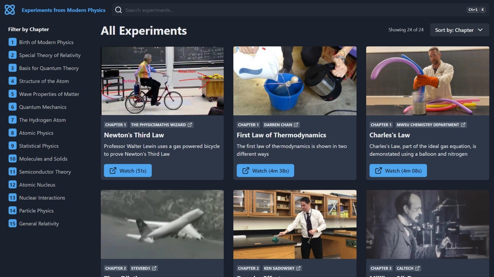

# Experiments from Modern Physics

<p align="center">
  
</p>

This website has links to videos demonstrating experiments relevant to the Modern Physics class (2305) at Missouri University of Science & Technology. [Hosted on Vercel](https://modphysics-experiments.vercel.app/)

The chapters correspond to *Modern Physics For Scientists and Engineers (4th Edition)* by Stephen Thornton.

## Built With

The following `node.js` libraries are required.

- `react`: Front-end javascript framework
- `chakra-ui`: UI component library
- `react-feather`: Icon pack
- `react-hotkeys-hook`: React plugin for shortcut keys

## Getting Started

After cloning the repository, install the required packages using `npm`

```bash
npm install
```

Along with the packages listed above, `vite` - the development environment - will also be installed.

```bash
# Start the local development server
npm run dev

# Build the website
npm run build

# View the compiled website
npm run preview
```

Due to way `vite` works, it is not possible to view the compiled `index.html` locally by opening it directly. The only way is using the preview command above.
